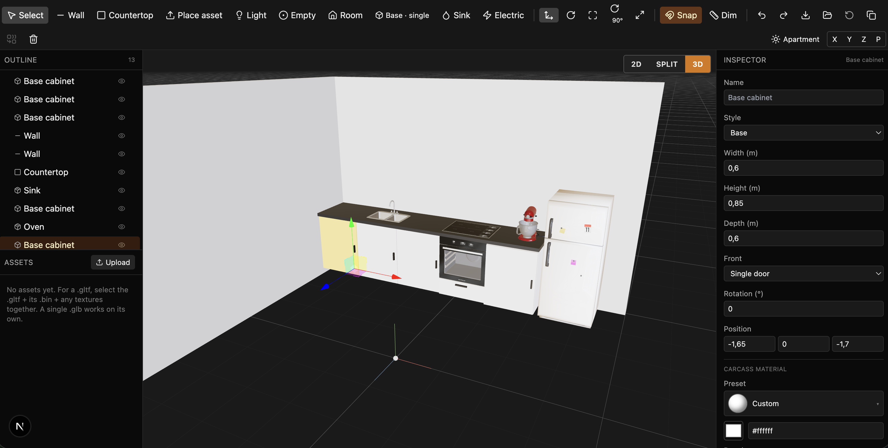

# Kitchen Builder

A browser-based modular 3D kitchen designer. Drop in cabinets, countertops,
walls, lights, and predefined appliances (sink, mixer, fridge, oven,
induction hob); arrange them in a 2D plan or 3D viewport with kitchen-aware
snapping; tweak materials and lighting; export the layout as JSON.



## Quickstart

```bash
npm install
npm run dev      # http://localhost:3000
npm run build    # production build
npm run typecheck
```

Node 20+ recommended.

## Highlights

- **Three viewports**: pure 2D plan, pure 3D, or a draggable split. The
  view-mode switcher floats over the canvas (top-right) so it's always
  accessible.
- **Kitchen-aware snapping**: cabinets/appliances flush side-to-side and
  back-to-back, countertops stack on cabinets and align edges, sinks/hobs
  sit on countertops, walls auto-flush to neighbours and cabinet backs
  with a generous 30 cm engage distance.
- **Auto-rotate near walls**: drop a cabinet or floor appliance within
  60 cm of a wall and it orients its back to the wall automatically.
- **Extrude**: alt+arrow grows one face by one snap step; alt+shift+arrow
  shrinks it. Direction follows the world axes regardless of object
  rotation.
- **Material presets**: PBR materials with color/normal/roughness maps,
  per-material tile and normal-strength sliders, a faux-3D ball thumbnail
  preset picker.
- **Undo/redo**, multi-select group transforms, group-by-empty merging,
  scene JSON export/import, lighting presets, ortho camera presets,
  measurement overlay.

## Tech stack

| Library                        | Purpose                                | Version (see `package.json`) |
| ------------------------------ | -------------------------------------- | ---------------------------- |
| [Next.js](https://nextjs.org)  | App framework (App Router)             | 15.x                         |
| [React](https://react.dev)     | UI                                     | 19.x                         |
| [Three.js](https://threejs.org)| 3D scene                               | 0.170                        |
| [@react-three/fiber](https://docs.pmnd.rs/react-three-fiber) | React renderer for Three | 9.x rc |
| [@react-three/drei](https://github.com/pmndrs/drei) | Helpers (Environment, Grid, OrbitControls, TransformControls, useGLTF) | 10.x |
| [Zustand](https://github.com/pmndrs/zustand) | Scene + editor stores       | 5.x                          |
| [Zundo](https://github.com/charkour/zundo) | Temporal middleware (undo/redo) | 2.x                          |
| [Zod](https://zod.dev)         | Schema validation for nodes            | 3.x                          |
| [mitt](https://github.com/developit/mitt) | Tiny event bus              | 3.x                          |
| [idb-keyval](https://github.com/jakearchibald/idb-keyval) | IndexedDB for user-uploaded GLTFs / textures | 6.x  |
| [three-bvh-csg](https://github.com/gkjohnson/three-bvh-csg) | Boolean ops (used for sink hole carving inspiration) | 0.0.17 |
| [Tailwind CSS](https://tailwindcss.com) | Styling                       | 3.x                          |
| [lucide-react](https://lucide.dev) | Icons                              | 0.462                        |
| [clsx](https://github.com/lukeed/clsx) | Conditional className           | 2.x                          |
| [nanoid](https://github.com/ai/nanoid) | ID generation                   | 5.x                          |

## Project structure

```
src/
  app/                      # Next.js entry (page + layout + globals.css)
  core/
    assets/                 # Predefined GLTF asset catalog + bbox cache + material presets
    events/                 # mitt-based emitter for grid:click / node:click
    geometry/               # Cabinet + wall geometry builders (Three BufferGeometry)
    registry/               # Map id → Object3D so the gizmo can attach
    schema/                 # Zod schemas for every node type
    store/                  # Zustand stores: scene (with zundo), editor, assets, textures
    systems/                # Snap logic, extrude, collision, cabinet stack, auto-rotate
    utils/                  # math (snap), id, place-sound (WebAudio)
  editor/                   # Toolbar, inspector, outliner, asset library, tool overlay
  viewer/
    canvas-2d.tsx           # 2D plan canvas (vanilla 2D context)
    canvas-3d.tsx           # 3D r3f canvas + lighting presets
    selection-gizmo.tsx     # TransformControls + sticky snap during drag
    placement-preview.tsx   # Hover ghost during cabinet/item placement
    dbl-click-mover.tsx     # Double-click to pick up, click to place
    measurements.tsx        # Dimension overlay
    renderers/              # Per-node-type r3f components
public/
  assets/<name>/scene.gltf  # Predefined GLTF appliances (Sketchfab CC-BY-4.0)
  audio/item_place.mp3      # Placement SFX
  materials/wood095/        # ambientCG Wood095 PBR maps
```

## Controls

| Key / Action            | Effect                                             |
| ----------------------- | -------------------------------------------------- |
| **V**                   | Select tool                                        |
| **B**                   | Wall draw                                          |
| **N**                   | Countertop                                         |
| **P**                   | Place asset (sink / mixer / fridge / oven / hob)   |
| **L**                   | Light                                              |
| **E**                   | Empty (group container)                            |
| **G / R / S**           | Translate / rotate / scale gizmo                   |
| **X**                   | Toggle snap                                        |
| **Q**                   | Rotate selection 90°                               |
| **0**                   | Reset selection's rotation                         |
| **Arrows**              | Nudge selection by snap step (Shift = ×10)         |
| **Alt + Arrows**        | Extrude one face by one snap step                  |
| **Alt + Shift + Arrows**| Shrink that face by one snap step                  |
| **Ctrl/Cmd + Z / Y**    | Undo / redo                                        |
| **Ctrl/Cmd + D**        | Duplicate selection                                |
| **Delete / Backspace**  | Delete selection                                   |
| **Esc**                 | Cancel wall draw / placement / move-mode           |
| **Double-click**        | Pick up object; next click drops it (snap-aware)   |

## Credits & attributions

### 3D models (CC-BY-4.0, via [Sketchfab](https://sketchfab.com))

All bundled appliance models are licensed under
[Creative Commons Attribution 4.0](https://creativecommons.org/licenses/by/4.0/).

- **Kitchen Sink** — by [HippoStance](https://sketchfab.com/hippostance) — [source](https://sketchfab.com/3d-models/kitchen-sink-504248ed68e3480a807aced6f002b2d5)
- **KitchenAid Stand Mixer** — by [MelissaVerdonck](https://sketchfab.com/MelissaVerdonck) — [source](https://sketchfab.com/3d-models/kitchenaid-stand-mixer-716dfa11eb8f4020833584a3c3d09d5d)
- **House Props - Fridge** — by [Whitend](https://sketchfab.com/whitend.3d) — [source](https://sketchfab.com/3d-models/house-props-fridge-2fdaa56bbd85404cb4206dcaedc16658)
- **Oven (no.1)** — by [lutz_westerfeld](https://sketchfab.com/lutzwesterfeld) — [source](https://sketchfab.com/3d-models/oven-no1-be59c580bda64e63bd9e8520f431be55)
- **Induction Stove (no.1)** — by [lutz_westerfeld](https://sketchfab.com/lutzwesterfeld) — [source](https://sketchfab.com/3d-models/induction-stove-no1-336d3327c28e4a1b905ea74f1e0b5a4b)

### PBR material textures

- **Wood095** — by [ambientCG](https://ambientcg.com/view?id=Wood095). ambientCG
  textures are released under
  [CC0 1.0](https://creativecommons.org/publicdomain/zero/1.0/) (public domain).

### Environment maps

The lighting presets (`apartment`, `studio`, `sunset`, `night`) load HDRI
environments via `@react-three/drei`'s `<Environment preset="…" />`, which
in turn fetches from [pmndrs/drei-assets](https://github.com/pmndrs/drei-assets)
(MIT-licensed environment maps).

### Audio

- `public/audio/item_place.mp3` — placement SFX. Replace with your own
  CC0/licensed sample if redistributing.

### Code references

- Snapping behaviour inspired by [Blender's
  vertex/edge/face snap modes](https://docs.blender.org/manual/en/latest/scene_layout/object/editing/snap.html)
  (the closest-point selection model and engage/release hysteresis).
- TransformControls usage patterns adapted from
  [react-three/drei's TransformControls](https://github.com/pmndrs/drei#transformcontrols)
  and three.js's
  [`TransformControls` example](https://threejs.org/examples/?q=TransformControls).
- Mitered wall corner math (`jointExtend` in `src/core/geometry/wall.ts`)
  derives from the standard `thickness/2 / tan(θ/2)` corner-extension
  formula common in CAD/2D-vector graphics.
- WebAudio placement-sound pattern (decode once, fresh `BufferSource` per
  play) is the standard MDN
  [Web Audio buffer playback](https://developer.mozilla.org/en-US/docs/Web/API/Web_Audio_API/Using_Web_Audio_API)
  recipe.

## License

Source code: MIT (see [`LICENSE`](LICENSE)) — except for third-party assets
under `public/`, which keep their own licenses (see Credits above).
